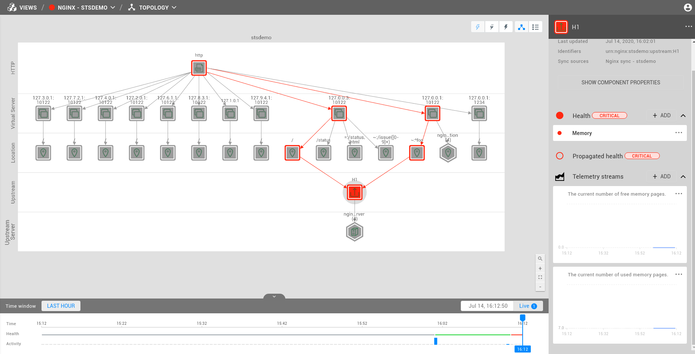

# CapitalOne PoC agent

## Testing
+ Manually link the following folders from https://github.com/StackVista/stackstate-agent-integrations in here:
  ```  
  ln -s [STACKSTATE_AGENT_INTEGRATIONS]/.setup-scripts
  ln -s [STACKSTATE_AGENT_INTEGRATIONS]/stackstate_checks_base
  ln -s [STACKSTATE_AGENT_INTEGRATIONS]/stackstate_checks_dev
  ln -s [STACKSTATE_AGENT_INTEGRATIONS]/stackstate_checks_tests_helper
  ```
+ Follow the setup and testing as described in https://github.com/StackVista/stackstate-agent-integrations#setup

## Installation
+ Go into `nginx-stackpack` and run `sbt package`.
+ Using the StackState CLI: Run `sts stackpack upload target/nginx-[VERSION].sts`.
+ Go into stackstate UI, and install stackpack.
+ Follow instructions in UI to configure the agent checks.

## Screenshots

1. Topology: The result of loading the topology from the following nginx configuration: [complex](nginx/tests/data/complex/nginx.conf)

2. Error propagation: In the case there's not enough memory for a zone

3. Going to the actual configuration using the `Go to Nginx SCM` component action

4. An example of all the metrics captured by StackState for an Upstream Server
